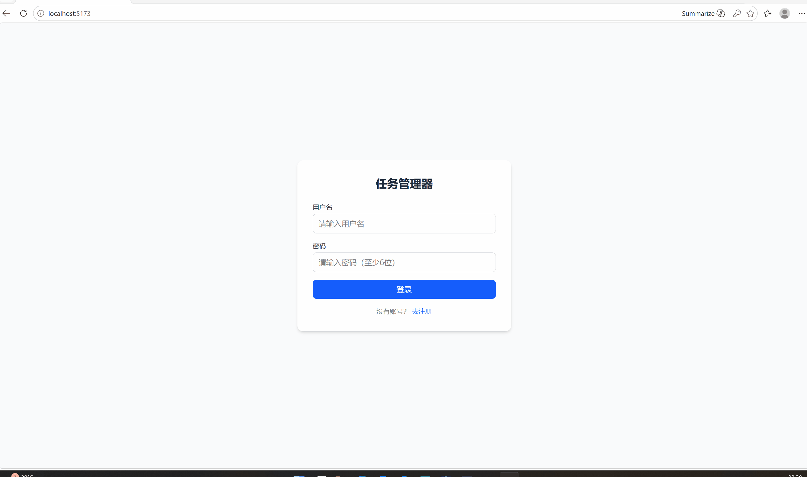
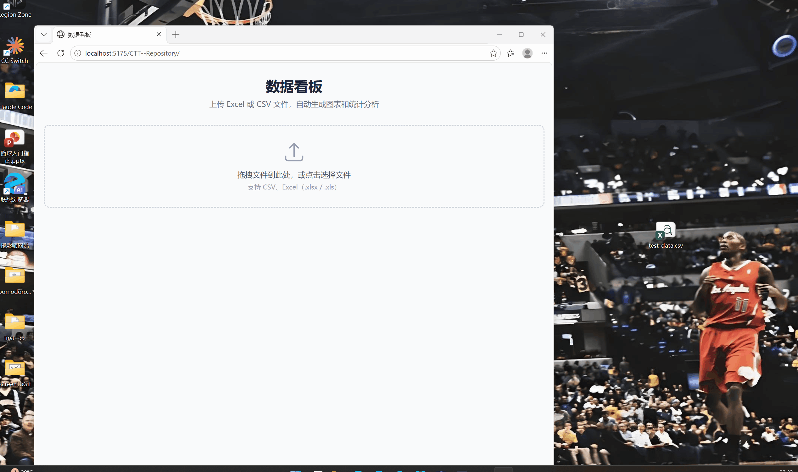

# 🚀 练手项目集合

两个全栈/前端实战项目，React + Node.js + 数据可视化。

> 🎯 目标：通过实战项目积累作品，为接外包做准备

---

## 📋 项目一：Todo 任务管理工具

全栈任务管理应用，支持用户注册登录、任务的增删改查、优先级排序和状态筛选。



### ✨ 功能

- 🔐 **用户认证** — JWT 注册/登录，7天有效
- ✅ **任务管理** — 创建、编辑、删除、完成标记
- 📊 **优先级系统** — 0-3 级优先级，高优先级置顶
- 🔍 **状态筛选** — 全部 / 待完成 / 已完成

### 🛠 技术栈

| 层级 | 技术 |
|------|------|
| 前端 | React 19 + Vite 8 + Tailwind CSS 4 |
| 后端 | Node.js + Express 5 |
| 数据库 | SQLite（sql.js，纯 JS 无需编译） |
| 认证 | JWT + bcryptjs |

### 🚀 本地运行

```bash
git clone https://github.com/Wencheng132/CTT--Repository.git
cd CTT--Repository

# 终端 1：后端（端口 3001）
cd server && npm install && npm start

# 终端 2：前端（端口 5173）
cd client && npm install && npm run dev
```

浏览器访问 **http://localhost:5173**

---

## 📊 项目二：数据看板

纯前端数据可视化工具，上传 CSV 或 Excel 文件，自动生成图表和统计分析。

🔗 **在线使用：https://wencheng132.github.io/CTT--Repository/**



### ✨ 功能

- 📂 **文件上传** — 支持 CSV/Excel（.xlsx/.xls），拖拽或点击上传
- 📊 **多种图表** — 柱状图、折线图、饼图，自由切换
- 📈 **统计分析** — 自动计算总和、均值、中位数、最大/最小值、标准差
- 🔍 **数据预览** — 表格展示数据，支持横向滚动

### 🛠 技术栈

| 层级 | 技术 |
|------|------|
| 框架 | React 19 + Vite 8 |
| 图表 | Recharts 2 |
| 样式 | Tailwind CSS 4 |
| 文件解析 | PapaParse（CSV）+ SheetJS（Excel） |
| 部署 | GitHub Pages |

### 🚀 本地运行

```bash
cd CTT--Repository/dashboard
npm install
npm run dev
```

浏览器访问 **http://localhost:5175**

---

## 📁 完整项目结构

```
first--cc/
├── client/                     # 项目一：Todo 前端
│   └── src/
│       ├── App.jsx
│       ├── api.js
│       └── components/
│           ├── Login.jsx
│           ├── TodoList.jsx
│           ├── TodoItem.jsx
│           └── TodoForm.jsx
├── server/                     # 项目一：Todo 后端
│   ├── index.js
│   ├── db.js
│   ├── auth.js
│   └── routes/
│       ├── auth.js
│       └── todos.js
├── dashboard/                  # 项目二：数据看板
│   ├── index.html
│   ├── vite.config.js
│   └── src/
│       ├── App.jsx
│       ├── main.jsx
│       ├── utils/
│       │   ├── parseFile.js    # CSV/Excel 解析
│       │   └── statistics.js   # 统计计算
│       └── components/
│           ├── Header.jsx
│           ├── FileUploader.jsx
│           ├── DataPreview.jsx
│           ├── ChartPanel.jsx
│           └── StatisticsPanel.jsx
└── docs/
    ├── todo-demo.gif
    └── dashboard-demo.gif
```

---

## 📄 License

MIT
